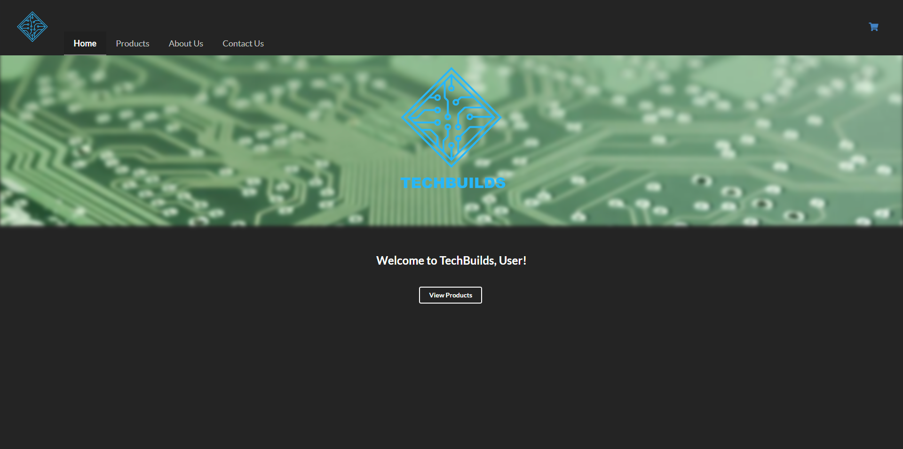

# TechBuilds 

## Description
    This application was created for someone looking for a place online to shop for computer parts. The application has a database of computer parts that
    will be listed on the Products page with the items information as well. It has an Account that will alow people to log in and out to save their carts.
    The application also has a cart and corresponding page for the items. There is a page for more information on the About Us page, and a way to get in
    touch through the Contact Us page.

## Technologies used
    mysql, CSS, JavaScript, SemanticUi, Sequilize, Handlebars, Express

## Usage
    Once the user enters the page they can log in to start looking at products or go to one of the other pages. If the user does not have an account under 
    the login is an option to regiser one. If they go to the products page, they will be able to browse all of the products and their information avalible
    on our application. Users can select products to add to the cart to save them for purchase now or later. Within the cart screen you can log out of your
    account and remove items you no longer want.

[GitHub-Repo](https://github.com/xwyckoff/BC-Project-Two.git)

## Credits
Collaborators:  
    [Alexander Wyckoff](https://github.com/xwyckoff)  
    [Janiece Lewis](https://github.com/Janiece-Lewis)  
    [Madison Schneider](https://github.com/madischneider3)  
    [Clay Moyer](https://github.com/ClayMoyer)  
    [Matt Hough](https://github.com/MatthewH2001)  

Background image credit:  
 https://www.hippopx.com/en/board-electronics-computer-data-processing-printed-circuit-board-data-cpu-54313

## License

MIT : https://opensource.org/license/mit/

